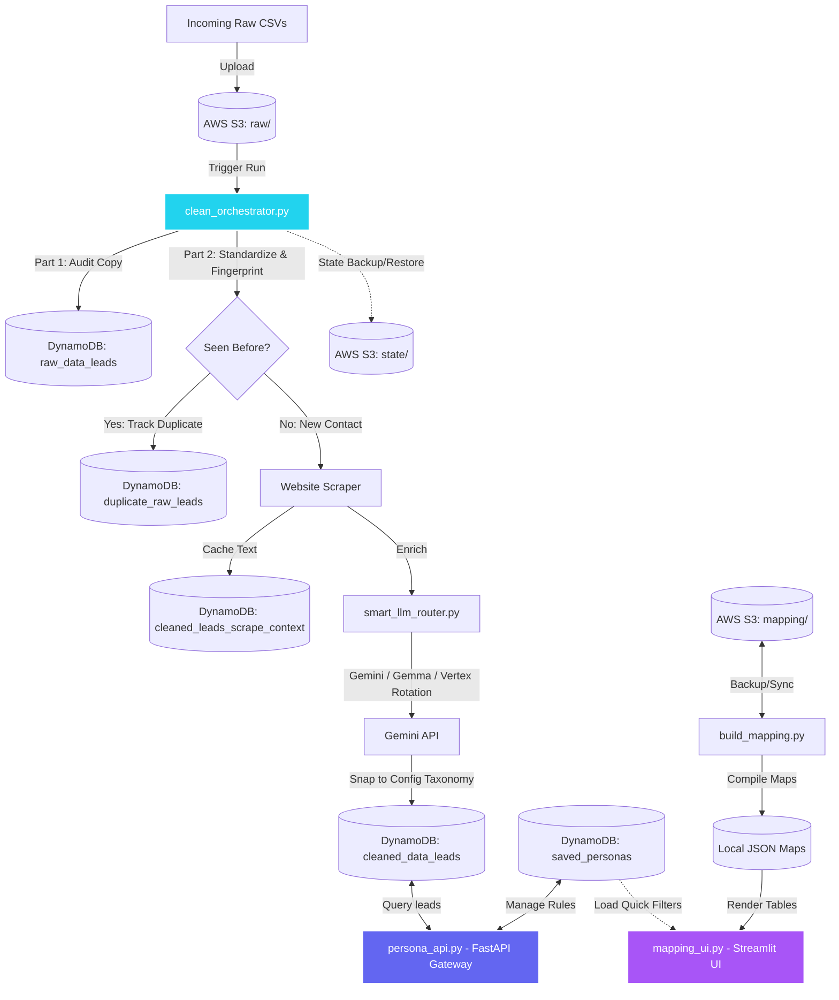
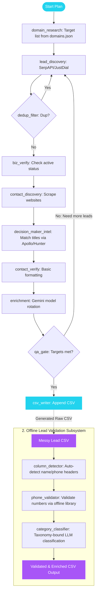

# Lead Management System (Monorepo)

Welcome to the **Lead Management System** repository. This project is structured as a monorepo consisting of two major, self-contained subsystems that work together to discover, enrich, validate, and search B2B leads.

---

## 📂 Repository Architecture

```text
lead-management-system/ (Git Repository Root)
├── README.md                      <-- This navigation guide
│
├── lead_management_system/
│   ├── lead_enrichment_system/    <-- Part 1: FastAPI Gateway, DynamoDB database, & Streamlit Dashboard
│   │   ├── README.md              <-- Technical Deep-Dive for Part 1
│   │   ├── lead_clean/            <-- ETL clean orchestrator, models & schemas
│   │   └── requirements.txt
│   │
│   └── scrape_and_validate_kit/   <-- Part 2: Local lead discovery LangGraph agent & phone validator
│       ├── README.md              <-- Technical Deep-Dive for Part 2
│       ├── lead_gen/              <-- LangGraph scraping runner & agents
│       ├── lead_val/              <-- Local CSV phone and domain tags validator
│       └── requirements.txt
```

---

## ⚡ Subsystem Overviews

### 🏢 1. Lead Enrichment System (`/lead_management_system/lead_enrichment_system`)
A cloud-native, crash-proof ETL platform that turns raw incoming lead CSV sheets into a **deduplicated, AI-enriched, instantly searchable lead database** — and serves it to any client UI through a FastAPI gateway.

*   **Key Features:** Auto-detects custom column names, streams raw audit replicas, creates permanent user identity hashes, runs a round-robin multi-model Gemini router for cost-friendly enrichment, and backs data in DynamoDB across 5 purpose-built tables.
*   **UI Components:** Includes a premium Streamlit dashboard showcasing company financial profiles, employee mappings, relationship statistics, and saved persona filters.
*   **Learn More:** Read the [Lead Enrichment System README](lead_management_system/lead_enrichment_system/README.md).



---

### 🛠️ 2. Scrape & Validate Kit (`/lead_management_system/scrape_and_validate_kit`)
A local-first, clone-and-run search tool to discover business leads from raw sources (SerpAPI Google Maps / JustDial) and run offline validations.

*   **Key Features:** A stateful LangGraph agentic discovery pipeline, browser-based web scraper (Playwright-ready), offline phone number parser, and an AI taxonomy validator.
*   **Taxonomy Sync:** Shares config files (snaps categories dynamically to `domains_subdomains.json`) and environment defaults with the main Enrichment system.
*   **Learn More:** Read the [Scrape & Validate Kit README](lead_management_system/scrape_and_validate_kit/README.md).



---

## ⚙️ Shared Setup & Environment Fallback

Both projects can be configured independently or run using shared resources. 

*   **Credentials Fallback:** Any environment variable not explicitly defined in `scrape_and_validate_kit/.env` automatically falls back to read from `lead_enrichment_system/.env` when run within this workspace, preventing double configuration.
*   **Configuration rules:** Copy `.env.example` to `.env` in both folders and input your Gemini AI Studio keys, AWS access keys, and optionally SerpAPI/Apollo keys.

---

For deep setup instructions, API contracts, deployment configurations (Modal/cron support), and database models, click through to the respective subfolders.
