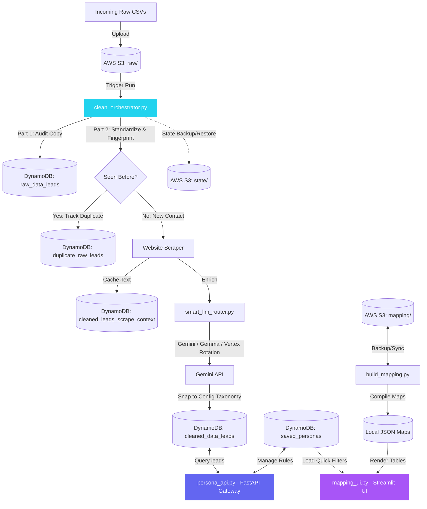

# Lead Enrichment System

A cloud-native, crash-proof ETL platform that turns messy raw lead CSVs into a **deduplicated, AI-enriched, instantly searchable lead database** — and serves it to any frontend through a FastAPI gateway.

You drop a CSV with any column naming and any level of mess into an S3 bucket. The system fingerprints it, replicates it raw for audit, standardizes it into a strict 27-column schema, assigns every human being a **permanent identity**, enriches each new lead with four AI-classified fields (Position, Domain, Sub Domain, Company Scale) using a fault-tolerant multi-model Gemini router, and lands the result in DynamoDB behind five purpose-built tables. Every step is resumable; nothing is ever processed twice; no lead is ever saved half-finished.


---

## 1. The real-world problem this solves

Sales and growth teams buy or scrape lead lists in the hundreds of thousands. Those lists arrive as CSVs that are **unusable for targeting**:

- Column names differ per vendor (`first_name`, `First Name`, `fname`, `person_first_name_unanalyzed` — all the same thing).
- The "industry" of a company is free text ("provides IT solutions", "we build software") — impossible to filter on.
- The same person appears in five files under slightly different rows, so campaigns double-send and metrics lie.
- Job titles are noise ("Director Enterprise Business Development and Client Success Partner") when what you need is a filterable bucket ("Director").
- One garbage row, one API quota error, or one crashed laptop can ruin a multi-day processing job.

This system converts that chaos into a database where a query like *"CEOs of Tier 3 Healthcare & Medical > Dental Care companies in Colorado"* returns in milliseconds — and where every processing run is idempotent, resumable, and free-tier-cheap.

---

## 2. System at a glance & workflows

This monorepo handles two primary workflows: the **Lead Enrichment ETL Pipeline** (which writes clean database leads to DynamoDB) and the **People ↔ Organization Mapping Dashboard** (which builds offline relationship profiles from CSV chunks).



### Workflow Purpose & Interaction
*   **Enrichment ETL (`clean_orchestrator.py`)**: Runs serverless cron tasks to pull messy raw CSVs from S3, archive copies to DynamoDB, deduplicate leads, scrape homepages, call the paced Gemini API rotation, and save taxonomy-compliant leads to DynamoDB.
*   **FastAPI Gateway (`persona_api.py`)**: Exposes REST endpoints to query lead profiles and manage custom target "Persona rules" inside DynamoDB.
*   **Relationships Dashboard (`build_mapping.py` & `mapping_ui.py`)**: Constructs corporate directory charts locally. It parses CSV chunks to compile mapping database files and opens a high-fidelity Streamlit UI featuring:
    *   **Financial Profiles** (Revenue, funding, founded year, employee counts).
    *   **Connection Statistics** (Company stats and directory lookups).
    *   **Multi-Org View** (Tracks contacts holding jobs across multiple companies).
    *   **Persona Integration**: Connects to the cloud DynamoDB API to load your saved target personas directly into the UI as pre-filled, interactive quick-filters.

| Component | File | Role |
|---|---|---|
| ETL Orchestrator | `lead_clean/clean_orchestrator.py` | The engine: discovery, raw replica, standardization, dedup, enrichment, save, state, resume |
| LLM Router | `lead_clean/smart_llm_router.py` | Multi-model Gemini/Gemma/Vertex round-robin with pacing, quota benching, failover |
| API Gateway | `lead_clean/persona_api.py` | Search, person lookup, persona (saved filter) APIs over DynamoDB |
| Cloud cron | `lead_clean/modal_app.py` | Hourly serverless pipeline runs on Modal |
| Cloud API | `lead_clean/modal_api.py` | Serverless deployment of the FastAPI gateway |
| Mapping builder | `lead_clean/scripts/build_mapping.py` | Builds People ↔ Organization relationship maps from CSV chunks |
| Mapping dashboard | `lead_clean/mapping_ui.py` | Streamlit UI to explore companies, employees, financials |
| Provisioner | `lead_clean/scripts/aws_setup.py` | One-shot idempotent creation of the bucket + all 5 tables + indexes |

**Stack:** Python · Pandas · Boto3 (S3, DynamoDB) · google-genai (AI Studio + Vertex AI) · BeautifulSoup · FastAPI/Uvicorn · Streamlit · Modal.

> 📊 Pre-rendered architecture & data-flow diagrams (system architecture, ETL flow, model-router states, search-API sequence) are in [`workflow_diagrams/diagrams/`](workflow_diagrams/diagrams/).

---

## 3. Repository layout — every file, what it does

```
lead_enrichment_system/
├── README.md                     ← this file
├── requirements.txt              ← Python dependencies
├── .env / .env.example           ← credentials + runtime knobs (see §5)
├── .gitignore                    ← ignores .env, keys, CSVs, venv, runtime state
├── .streamlit/config.toml        ← dark theme for the mapping dashboard
├── .vscode/settings.json         ← points VS Code at lead_env's interpreter
├── workflow_diagrams/diagrams/   ← rendered architecture & data-flow PNGs
├── lead_env/                     ← project virtualenv (git-ignored)
└── lead_clean/
    ├── clean_orchestrator.py     ← THE PIPELINE (deep dive in §7)
    ├── smart_llm_router.py       ← model rotation / quota survival (§7.9)
    ├── persona_api.py            ← FastAPI search & persona gateway (§9)
    ├── modal_app.py              ← Modal hourly-cron wrapper (§11)
    ├── modal_api.py              ← Modal ASGI wrapper for the API (§11)
    ├── mapping_ui.py             ← Streamlit people↔org dashboard (§10)
    ├── configs/
    │   ├── column_mapping.json       ← standard column → list of messy aliases
    │   ├── domains_subdomains.json   ← THE taxonomy: 35 domains → subdomains
    │   ├── positions.json            ← canonical job-position buckets
    │   ├── industries.json           ← dropdown values for the UI
    │   ├── locations.json            ← dropdown values for the UI
    │   ├── unique_keywords.json      ← 71k keywords extracted from leads (UI autocomplete source)
    │   ├── model_limits.json         ← the model roster: name, vertex flag, rpm, rpd
    │   └── research_lab_service_key.json  ← GCP service account for Vertex (git-ignored)
    ├── mapping_data/             ← person_map.json / org_map.json / processed_etags.json (git-ignored, rebuilt from S3)
    └── scripts/
        ├── aws_setup.py          ← provision bucket + 5 tables + 5 GSIs, idempotent
        └── build_mapping.py      ← incremental people↔org map builder
```

Created at runtime (git-ignored): `pipeline_data/` — the state journal, model state, CSV cache, and AI telemetry (§7.8).

---

## 4. The data model — five DynamoDB tables, and why each exists

| Table | Keys | Why it exists |
|---|---|---|
| **`cleaned_data_leads`** | PK `User_ID` + 5 GSIs (`Position-Index`, `Industry-Index`, `Domain-Index`, `SubDomain-Index`, `NameSearch-Index`) | The product: fully enriched leads. The GSIs make every primary filter an *indexed query*, not a table scan — this is what makes search fast and cheap at 100k+ rows. |
| **`raw_data_leads`** | PK `User_ID` (per-row UUID) | An untouched replica of every raw row ever ingested. Why: auditability ("what did the vendor actually send us?") and a separate fuzzy raw-search API. Isolated so no cleanup step can ever destroy source data. |
| **`duplicate_raw_leads`** | PK `User_ID` + SK `Duplicate_ID` | Every *re-occurrence* of a known lead, keyed under the **original lead's** `User_ID` so all copies of one person sit together. Why: duplicates are evidence (a lead appearing in 6 purchased lists is a signal), but they must never reach the AI (cost) or the cleaned table (integrity). |
| **`cleaned_leads_scrape_context`** | PK `User_ID` | The website text scraped for each lead at enrichment time. Why: it lets you re-run or audit AI decisions later without re-scraping, and it is future fuel for embeddings/RAG. |
| **`saved_personas`** | PK `Persona_ID` | Saved filter profiles (rules only, never lead data). Why: rules stored instead of results means a persona's leads are always **fresh** — re-executed against the live table on every request. |

Two derived attributes are written onto every cleaned lead: `Name_Search` (lowercase `"first last"`) and `Company_Search` (lowercase company name). Why: DynamoDB string comparison is case-sensitive; these normalized companions are what make person lookup case-insensitive *and* indexable (the `NameSearch-Index` GSI serves exact full-name queries directly).

---

## 5. Configuration

### 5.1 `.env` — credentials and knobs

| Variable | Required | Purpose |
|---|---|---|
| `GEMINI_API_KEY` | yes | Google AI Studio key — used by every model whose `vertex` flag is `false` |
| `AWS_ACCESS_KEY_ID` / `AWS_SECRET_ACCESS_KEY` | yes | AWS credentials for S3 + DynamoDB |
| `AWS_DEFAULT_REGION` | yes (default `us-east-1`) | Region for every AWS client |
| `AWS_S3_RAW_BUCKET_NAME` | yes | Bucket holding `raw/` input CSVs and `state/` backups |
| `AWS_DYNAMODB_TABLE_NAME` | yes (default `cleaned_data_leads`) | Cleaned table name |
| `AWS_DYNAMODB_RAW_TABLE_NAME` | yes (default `raw_data_leads`) | Raw table name |
| `LEADS_MAPPING_BUCKET` | for mapping only | Bucket with `people/`, `organization/` chunks and `mapping/` outputs |
| `MAX_NEW_LEADS` | no | Cap newly enriched leads per run (testing / cost control) |
| `MAX_RUN_SECONDS` | no | Soft time budget — the run stops **cleanly** before this elapses (§7.8) |
| `PIPELINE_CONCURRENCY` | no | Parallel enrichment workers; default `3 × active models`, capped at 30 |
| `PIPELINE_FILE_DISCOVERY` | no | `hourly` (default) lists S3 every run; `daily` lists once/day and caches |
| `PIPELINE_DATA_DIR` | no | Where state/cache live locally (default `pipeline_data/`) |
| `PIPELINE_LOCAL_RAW_DIR` | no | Point at a local folder of CSVs to bypass S3 entirely (testing) |
| `API_KEY` | no | If set, every `/api/*` request must send it as `X-API-Key`; unset = open (local dev) |
| `ENV_PATH` | no | Alternate .env location for cloud deploys |

Vertex AI models authenticate via `configs/research_lab_service_key.json` instead of the API key. *(Note: the Vertex project id and region are currently hardcoded in `smart_llm_router.py` — edit there if you migrate GCP projects.)*

### 5.2 `configs/` — the rulebooks

- **`column_mapping.json`** — maps each of the 27 standard columns to every messy alias seen in the wild. Why a config and not code: onboarding a new vendor's CSV format means adding aliases to a JSON file, zero code changes.
- **`domains_subdomains.json`** — the strict two-level taxonomy (35 domains). The AI is *forbidden* from inventing categories; everything it answers is validated (and snapped) against this file. Editing this file instantly changes how the whole system classifies.
- **`positions.json`** — the canonical set of position buckets (CEO, Director, Founder…). Same contract: the model must pick from this list, output is force-matched to it.
- **`model_limits.json`** — the model roster. Each entry: `model_name`, `vertex` (which client to use), `limits.rpm`, `limits.rpd`. Adding/removing a model = editing this file only; the router adapts automatically, including the concurrency default.
- **`industries.json` / `locations.json` / `unique_keywords.json`** — populate the UI dropdown endpoints.

---

## 6. Setup from scratch

```bash
git clone <your-repo-url>
cd <repo>/lead_management_system/lead_enrichment_system   # this folder holds lead_clean/ + requirements.txt
python -m venv lead_env
.\lead_env\Scripts\activate            # Windows | source lead_env/bin/activate (Mac/Linux)
pip install -r requirements.txt
```

1. Copy `.env.example` → `.env`, fill in AWS + Gemini credentials (see the §5.1 table for every variable).
2. Place your GCP service-account key at `lead_clean/configs/research_lab_service_key.json` (only needed for `vertex: true` models).
3. Provision all AWS resources (safe to re-run; existing resources are left untouched):
   ```bash
   python lead_clean/scripts/aws_setup.py
   ```
4. Upload a raw CSV to `s3://<bucket>/raw/`.
5. Run the pipeline:
   ```bash
   python lead_clean/clean_orchestrator.py
   ```
6. Run the API:
   ```bash
   python lead_clean/persona_api.py       # Swagger at http://127.0.0.1:8000/docs
   ```

Local smoke test without S3: `MAX_NEW_LEADS=10 PIPELINE_LOCAL_RAW_DIR=path\to\csvs python lead_clean/clean_orchestrator.py`

---

## 7. The ETL pipeline — every step, what moves where, and why

This section follows one run of `clean_orchestrator.py` from process start to exit.

### 7.0 Boot: environment → configs → AWS clients → state

The run loads `.env`, parses the config JSONs into fast lookup structures (a reverse column map; lowercase→canonical maps for positions, domains, subdomains; a minified taxonomy string for prompts), builds boto3 handles to S3 + the four pipeline tables, and instantiates the `StateManager`.

The StateManager first checks whether its three state files exist locally — and **if any is missing, restores it from `s3://<bucket>/state/`**. Why: the pipeline must survive losing its entire local disk (new laptop, fresh Modal container). State lives in three files:

- **`lead_registry.jsonl`** — an *append-only journal* of every lead ever seen: `{"t":"lead","k":<fingerprint>,"u":<User_ID>,"s":"pending"|"enriched","o":"file:row"}` plus `{"t":"dup", ...}` records for duplicate copies. Append-only is deliberate: a crash can at worst tear the final line (which the loader skips harmlessly); it can never corrupt history the way rewriting a JSON file mid-crash could.
- **`processed_files.json`** — per-CSV ETag + progress bookmarks (`raw_rows_done`, `raw_streamed`, `part2_done`) and the list of fully-done content ETags.
- **`model_state.json`** — the router's daily quota memory (§7.9).

### 7.1 Reconciliation — trust DynamoDB, not the journal

Before touching any file, `reconcile_pending()` takes every lead whose journal status is `pending` (i.e., a previous run died between "started enriching" and "confirmed saved") and asks the **cleaned table** what actually happened:

- Row exists with all 4 enrichment fields filled → the save *did* land; promote to `enriched` in the journal.
- Row exists but partial → delete the half-row and redo the lead. **The same `User_ID` is reused**, so identity is permanent even across failures.
- Row absent → redo.

Why this design: the journal alone can lie (crash after DynamoDB write but before journal append). Reconciliation makes DynamoDB the source of truth and the journal merely an intent log — the combination gives exactly-once *effective* semantics without transactions.

### 7.2 File discovery — ETag fingerprinting

The orchestrator lists `s3://<bucket>/raw/*.csv` and pairs each key with its **S3 ETag** (a content hash). Decision table per file:

- Same key, same ETag, `part2_done` → **skip silently** (already fully processed).
- *Different* key but ETag in `done_etags` → **skip**: someone re-uploaded the identical file under a new name; content identity, not filename, is what counts.
- Same key, *new* ETag → the vendor replaced the file's content → progress for that file resets and it is treated as new.

Why: uploads are human-driven and humans re-upload things. ETag fingerprinting makes every ingest idempotent at zero cost. With `PIPELINE_FILE_DISCOVERY=daily`, the S3 listing itself is cached for 24h so 23 of 24 hourly cron runs skip the LIST call.

The CSV is downloaded once into `pipeline_data/raw_cache/<etag>_<name>` — cache keyed by content, so a changed file can never collide with its predecessor.

### 7.3 Part 1 — the raw replica

Every row of the CSV is streamed into `raw_data_leads` **byte-for-byte untouched**, with only two changes: a per-row UUID (DynamoDB needs a key) and column *headers* renamed to standard names (so the raw-search API can query `Title`/`Industry`/`Keywords` across vendors). Cell values are never modified — that is the whole point of this table.

It is streamed through DynamoDB's `batch_writer` (25-item batches) with a bookmark (`raw_rows_done`) saved every 10,000 rows — a multiple of 25, so at every checkpoint the write buffer is guaranteed flushed and *bookmark == rows actually committed*. If the soft time budget expires mid-stream, the run pauses **at a checkpoint** and the next run resumes from that exact row. Why: a 250k-row file must survive the 50-minute cloud window without either re-streaming from zero or double-writing rows.

### 7.4 Part 2A — standardization

The raw DataFrame is mapped through `column_mapping.json` into the strict 27-column schema, then every row is scrubbed:

- Whitespace trimmed; literal `"nan"`/`"none"` strings emptied.
- A full name sitting in *First Name* is split ("Priya Sharma" → First: Priya, Last: Sharma) — the dedup identity depends on name fields being comparable.
- City/State/Country/Industry are cleaned aggressively: junk tokens (`#ERROR!`, `n/a`, `true`, `false`), 1-character values, anything containing digits/symbols/URLs → blanked. Why blank instead of "fix": a wrong location silently poisons filtered campaigns; an empty one is honest.
- Abbreviations normalized (`us`/`USA` → United States, `uk` → United Kingdom) and Title-Cased — so location filters don't fragment across spellings.

The standardized result is cached to disk as `<csv>.standardized.csv` keyed by ETag (validated by row count + column list on load). Why: standardization of a huge file is minutes of pandas work; on a 24-runs/day schedule it must happen once per file version, not 24 times.

### 7.5 Identity & dedup — the permanent `User_ID`

Every row gets a **fingerprint**: the lowercase join of *First Name + Last Name + Title + Position + Company Name + Company Email*. (A row where all six are blank gets a synthetic per-row key — unidentifiable rows are never groupable, by design.)

- **First occurrence ever** (across all files, all runs, all time): the row becomes *the lead*, receives a freshly minted UUID as `User_ID`, and is journaled as `pending`.
- **Any later occurrence** (same file, another file, next month): written to `duplicate_raw_leads` under the original's `User_ID` with its own `Duplicate_ID`, source file, and row index — and the original's row in the cleaned table gets `is_duplicate: "Yes"` flipped via a conditional update. The copy **never reaches the AI**.

Why permanence matters: `User_ID` is the join key across all five tables (cleaned row ↔ scrape context ↔ duplicates). Because the ID survives retries, crashes, and re-runs, downstream consumers (CRMs, mapping, analytics) can reference leads without fear of identity churn.

### 7.6 Part 2B — AI enrichment

For each `pending` lead, a worker:

1. **Scrapes the company website** (6-second timeout, headers spoofed, `title/meta/p/h1/h2` text only, cleaned and capped at 1,500 chars). The text is saved to `cleaned_leads_scrape_context`. A failed scrape is *not* fatal — the model still gets Industry + Keywords context. Why the cap: prompt cost control; 1,500 chars of homepage text is plenty for classification.
2. **Builds a strict prompt** containing the lead's Title, Employees/Revenue/Funding, Industry, Keywords, the scrape text, the *verbatim* positions list, and the *minified full taxonomy* — and demands exactly four JSON keys: `position`, `company_scale`, `domain`, `sub_domain`.
3. **Calls the router** (§7.9) which picks a model, paces the call, and fails over on errors.
4. **Validates the answer** — the critical anti-hallucination stage. Each value is resolved to the **nearest allowed config value** through a cascade: exact case-insensitive match → C-suite acronym derivation ("Chief Marketing Officer" → CMO, anchored to the literal *Chief … Officer* shape so "Customer Experience Officer" can NOT become CEO) → whole-word substring (most specific wins: "Executive Vice President" → "Vice President") → fuzzy similarity → default bucket. Why "snap to nearest" instead of "reject": a deterministic model (temperature 0) that answers "Cheif Marketing Officer" would fail identically on every retry — rejection would trap the lead in an infinite retry loop. Snapping guarantees convergence while the taxonomy guarantees the result is always a *legal* value. Company Scale is regex-extracted (`Tier 1–4`, defaulting to Tier 4) for the same reason.
5. Truly invalid output (unparseable JSON, empty domain) raises `EnrichmentError` → the lead **stays `pending`** and is retried next run. It is never saved half-filled.

### 7.7 Part 2C — save

Only a fully validated lead is written to `cleaned_data_leads`: the 27 standard columns (empty values omitted — DynamoDB best practice), the `is_duplicate` flag, and the `Name_Search`/`Company_Search` companions. Only after DynamoDB confirms the write does the journal record flip to `enriched`. That ordering *is* the crash-safety contract: the journal never claims something the database doesn't have.

### 7.8 Concurrency, ordering, and the time budget

Enrichment runs with a pool of async workers (default `3 × models`, max 30) — but correctness is protected by a **single locked dispatcher**:

- Rows are handed out strictly in CSV index order, and a new lead's fingerprint is *reserved in the registry at hand-out time, under the lock*. Why: with parallel workers, two copies of the same person in one file could otherwise both look "new" simultaneously; reservation makes the second copy always see the first and route to the duplicates table. Dedup stays exact under any concurrency.
- Only cheap in-memory operations happen under the lock; scraping, LLM calls, and DynamoDB writes run outside it, so workers truly overlap.
- Workers cannot hammer Google: every LLM call still funnels through the router's per-model pacing gate. Extra workers just queue at the gate — concurrency raises *throughput to the pacing ceiling*, never past it. Blocking I/O (scrapes, boto3) runs in a thread pool sized to the worker count so one slow 6-second scrape never freezes the event loop.
- **`MAX_RUN_SECONDS`** is checked at dispatch: when the budget is spent the dispatcher stops handing out rows, in-flight work completes, state is saved and backed up. Why a *soft* budget: the alternative — the platform's hard kill — could land mid-write; the soft stop always lands on a clean row boundary. (Cloud runs use 3,000s inside Modal's 3,600s hard timeout.)

Throughout the run, the journal is backed up to `s3://<bucket>/state/` every 1,000 appends and always once more in a `finally` block — so even a crashed run leaves its progress recoverable from S3.

### 7.9 `SmartLLMRouter` — surviving quotas on the free tier

The router treats models declared in `model_limits.json` as a rotating pool with per-model discipline:

- **Pacing:** each model is called at most `rpm` times/minute — enforced by reserving timestamped slots (workers sleep until their slot). Google never sees a burst.
- **Daily budget:** `rpd` per model per day, counted in `model_state.json`.
- **The quota day resets at midnight *Pacific*** (`America/Los_Angeles`), because that is Google's actual reset clock. Why it matters: computing "today" in UTC would keep a benched model benched up to 7 extra hours after Google had already reset it.
- **429 on an API-key model:** first hit → 70s cooldown then one more chance (it may just be the *per-minute* quota); second hit in the same run → the *daily* quota is genuinely gone → **benched until the Pacific-midnight reset**. A success clears the strike, so an isolated blip can never escalate into a wrongful day-bench.
- **429 on a Vertex model:** Vertex pay-as-you-go has *no daily quota* — its 429s are transient shared-capacity. So Vertex models are **never day-benched**; instead the cooldown escalates 30s → 60s → 120s → 300s and resets on success.
- **Any other error (500/503/network):** benched for *this run only*, retried next run; failing two consecutive runs → day-benched. Why the two-tier response: transient infra errors self-heal between runs; persistent ones shouldn't burn a retry every hour.
- **Failover:** a failing model never loses a lead — the same request immediately moves to the next available model. Only when *every* model is benched does the run halt with `QuotaExhaustedAllModels`, all progress saved; the next cron run starts exactly where this one stopped.
- **Telemetry:** every call (model, latency ms, status, token count, lead id) is appended to `pipeline_data/ai_ops_telemetry.csv` — the audit trail for cost, model health, and debugging.

---

## 8. Case scenarios — what actually happens when…

**…you upload a brand-new CSV?** Next run: ETag unknown → raw replica streams (bookmarked every 10k rows) → standardize (cached) → each row deduped and enriched in order → file marked `part2_done` and its ETag recorded. Re-runs then skip it forever.

**…someone re-uploads the same file as `final_v2_REALLY.csv`?** The key is new but the ETag matches `done_etags` → skipped with a log line. Zero AI spend, zero duplicate rows.

**…the process is killed mid-enrichment (power cut, Ctrl-C, container eviction)?** At most the current in-flight leads are ambiguous — each is journaled `pending`. Next run, reconciliation checks each against DynamoDB: complete → promoted; partial → deleted and redone; absent → redone. Same `User_ID` either way. The registry's torn last line (if the crash hit mid-append) is skipped by the loader. Net data loss: zero.

**…the model answers "Cheif Marketing Officer" or "Health Care"?** The validator snaps them to `CMO` and `Healthcare & Medical`. The taxonomy cannot be escaped, and near-miss spelling can never trap a lead in a retry loop.

**…the model returns unparseable garbage?** `EnrichmentError` → lead stays `pending`, retried next run (likely landing on a different model in the rotation). Never saved half-filled.

**…Gemini's free tier runs dry at 2 p.m.?** Each API-key model 429s, cools down 70s, 429s again, gets day-benched. Vertex models keep serving through escalating cooldowns. If literally everything is benched, the run stops cleanly and the state notes persist — at the next Pacific midnight, counters reset and the hourly cron resumes automatically. Un-enriched leads simply wait as `pending`.

**…the same person arrives in a file three months later?** Fingerprint matches → the new copy lands in `duplicate_raw_leads` under the original `User_ID`, and the original's `is_duplicate` flips to "Yes". The AI is never called for it.

**…the 50-minute cloud window ends during a 250k-row raw stream?** The stream pauses at a 10k checkpoint, bookmark saved. The next hourly run resumes at that exact row. The same soft budget protects enrichment via the dispatcher.

**…your laptop dies and `pipeline_data/` is gone?** On the next machine, the StateManager restores all three state files from `s3://<bucket>/state/`; anything after the last backup is healed by reconciliation against DynamoDB. The system's memory is cloud-redundant by construction.

**…two identical people sit in one file at rows 120 and 8,455?** The dispatcher reserves row 120's fingerprint at hand-out; when row 8,455 is dispatched — even to a parallel worker — the reservation is already visible → duplicates table. Order and locking make dedup exact under concurrency.

---

## 9. The API gateway (`persona_api.py`)

Run locally (`python lead_clean/persona_api.py` → Swagger at `/docs`) or deploy via `modal_api.py`. If `API_KEY` is set in the env, every `/api/*` call must carry it in the `X-API-Key` header; unset means open access for local dev. CORS is open so any frontend can call it.

**A critical design detail — the paginated scan.** DynamoDB applies `FilterExpression` *after* reading a page, so a naive `scan(Limit=200)` inspects 200 *rows* and may return 3 matches even though thousands exist. Every search endpoint therefore uses helpers that keep paging (`LastEvaluatedKey`) until enough *matches* are collected or data ends, with a hard cap (`MAX_PAGES=200`) as a runaway guard. Without this, search results would be silently, arbitrarily incomplete.

| Endpoint | Input → Output |
|---|---|
| `GET /api/options/{positions\|industries\|domains\|sub_domains\|locations\|keywords}` | Dropdown values read live from `configs/` (`sub_domains?domain=X` cascades; keywords sliced to 1,000 for UI sanity) |
| `GET /api/leads/search` | `position`, `industry`, `domain`, `sub_domain` (exact; the **first** filter is served by its GSI, the rest apply as filters), `location` (comma-separated, matches City OR State OR Country), `limit` (default 200, max 1000) → ordered lead JSON rows |
| `GET /api/leads/search/raw` | Case-tolerant `contains` search over the untouched raw table by `title`, `industry`, `keywords`, `location` |
| `GET /api/leads/person` | `name` (first, last, or full — any casing/order; comma-separated for several people), `organization`, `linkedin`. Exact full names hit the `NameSearch-Index` GSI; partial names use token-AND `contains` over `Name_Search`. Results deduped by `User_ID` |
| `POST /api/leads/people` | Batch person lookup: a JSON list of up to 50 query dicts (`name`/`organization_name`/`linkedin_id` + standard filters; fields AND within a dict) → one `{query, count, leads}` block per dict |
| `POST /api/personas` / `GET /api/personas` | Save / list filter profiles (auto-generated `PRS-XXXXXXXX` ids). Rules only — never lead data |
| `GET /api/personas/{id}/leads` | Re-runs the saved rules against the live table → always-fresh results |

---

## 10. People ↔ Organization mapping

A side pipeline that answers "who works where?" from vendor data that only links person→org, never org→people.

- **`scripts/build_mapping.py`** — reads CSV chunks from `s3://<LEADS_MAPPING_BUCKET>/people/` and `organization/` (or `--local` folders), and incrementally maintains `person_map.json` (person → profile + org ids) and `org_map.json` (org → profile, financials, and the **reverse index** `people_ids`). ETag tracking skips already-merged chunks; merges are idempotent (re-runs can never duplicate a person inside an org); people referencing unknown orgs get stub org entries so nobody is dropped. State mirrors to `s3://…/mapping/`.
- **`mapping_ui.py`** — a dark-theme Streamlit dashboard over those maps: organization profiles (employees, revenue in thousands, funding, founded year), connection statistics (claimed headcount vs people we actually hold), employee drill-down per company, people search with persona quick-filters (loaded from the `saved_personas` table, cached 5 min), and a multi-org view listing people connected to more than one company. Launch: `streamlit run lead_clean/mapping_ui.py`.

---

## 11. Cloud deployment (Modal)

```bash
modal deploy lead_clean/modal_app.py      # hourly pipeline cron
modal deploy lead_clean/modal_api.py      # serverless API
modal run lead_clean/modal_app.py --max-new-leads 8   # manual capped test run
```

`modal_app.py` schedules `hourly_lead_cleaner` (cron `0 * * * *`) with deliberate guard rails: **`max_containers=1`** so two runs can never overlap and corrupt state; **`timeout=3600`** as a hard backstop while `MAX_RUN_SECONDS=3000` makes every run stop *cleanly* at 50 minutes; **`PIPELINE_FILE_DISCOVERY=daily`** so only the first run of each day lists S3; a persistent volume at `/data` for state (committed in a `finally`, so state survives even a crashed run); and credentials injected at deploy time from your local `.env` via `modal.Secret.from_dotenv` — nothing sensitive is baked into the image. The Vertex service key ships inside `lead_clean/configs/`.

Because all state is on the volume *and* backed up to S3 *and* reconcilable from DynamoDB, the entire Modal app can be deleted and redeployed at any time without losing a single lead.

---

## 12. Operations runbook

- **Watch a run:** console logs show per-stage progress (`[RAW] 120000/250000 rows`, `enriched this run: 250`); `pipeline_data/ai_ops_telemetry.csv` records every AI call.
- **Cap costs while testing:** `MAX_NEW_LEADS=20`.
- **Process local files without S3:** `PIPELINE_LOCAL_RAW_DIR=D:\test_csvs`.
- **Add a model:** append to `configs/model_limits.json` — the router, pacing, and concurrency adapt on next start.
- **Change classification behavior:** edit `domains_subdomains.json` / `positions.json`; no code changes.
- **Force a file to reprocess:** its content changed → automatic (new ETag). Same content → remove its entry/ETag from `pipeline_data/state/processed_files.json` (and the S3 copy).
- **Lock the public API:** set `API_KEY` in `.env` before deploying `modal_api.py`.

## 13. Design principles (the short version)

1. **Idempotent by content, not by name** — ETags decide what's new; re-uploads are free.
2. **Exactly-once effect without transactions** — append-only journal + reconciliation against the database of record.
3. **Never save half a lead; never lose a lead** — invalid AI output waits for the next run; failing models fail over.
4. **Snap, don't reject** — deterministic near-misses converge to legal taxonomy values instead of looping.
5. **Degrade, never die** — quota exhaustion, scrape failures, missing state, container kills: all downgrade to "resume later".
6. **Permanent identity** — one `User_ID` per human, forever, across every table and retry.
7. **Free-tier discipline** — per-model rpm/rpd pacing, Pacific-midnight quota clock, duplicate suppression *before* any paid call.

---

## 14. Related project

`../scrape_and_validate_kit/` — the standalone local lead **discovery** toolkit (LangGraph scraper + CSV validator). It *generates* raw lead CSVs; this system *refines* them. The two share the taxonomy (this repo's `domains_subdomains.json` is the kit's fallback) and can share one `.env`.
