# Local Lead Generation & Validation System

A fully **local, clone-and-run** system that discovers business leads by *domain + city*, enriches and QA-checks them through a LangGraph agent pipeline, saves them to CSV, and then validates/classifies any lead CSV against a strict domain taxonomy. No cloud infrastructure required — only free-tier API keys.

Two independent subsystems:

| Subsystem | Entry point | What it does |
|---|---|---|
| `lead_gen/` | `python lead_gen/main.py` | Scrapes/discovers businesses per (domain, subcategory, city), finds decision-maker contacts, AI-enriches, QA-gates, writes per-domain CSVs |
| `lead_val/` | `python lead_val/run_validation.py` | Adds `domain_tag`/`subdomain_tag` (AI, taxonomy-bound) + phone validation columns to any raw lead CSV |

---

## System at a Glance

This kit provides two distinct utilities: **`lead_gen/`** (the LangGraph agentic scraping loop) and **`lead_val/`** (the offline phone and taxonomy classifier).

```mermaid
graph LR
    subgraph Lead_Gen_Pipeline ["1. Lead Generation (LangGraph Pipeline)"]
        direction TB
        %% Row 1: Plan & Discover
        Start([Start Plan]) --> Research[domain_research: Target list from domains.json]
        Research --> Discovery[lead_discovery: SerpAPI/JustDial]
        Discovery --> Dedup{dedup_filter: Dup?}
        
        Dedup -->|Yes| Discovery
        Dedup -->|No| Verify[biz_verify: Check active status]

        %% Row 2: Scraping & Intelligence
        Verify --> Contacts[contact_discovery: Scrape websites]
        Contacts --> Intel[decision_maker_intel: Match titles via Apollo/Hunter]
        Intel --> PhoneVal[contact_verify: Basic formatting]
        PhoneVal --> Enrich[enrichment: Gemini model rotation]

        %% Row 3: QA Gate & Save
        Enrich --> QAGate{qa_gate: Targets met?}
        QAGate -->|No: Need more leads| Discovery
        QAGate -->|Yes| Writer[csv_writer: Append CSV]
    end

    subgraph Lead_Val_System ["2. Offline Lead Validation Subsystem"]
        direction TB
        RawCSV[Messy Lead CSV] --> Detector[column_detector: Auto-detect name/phone headers]
        Detector --> OfflinePhone[phone_validator: Validate numbers via offline library]
        OfflinePhone --> Classifier[category_classifier: Taxonomy-bound LLM classification]
        Classifier --> CleanCSV[Validated & Enriched CSV Output]
    end

    %% Flow connection to bridge them side-by-side
    Writer -.->|Generated Raw CSV| RawCSV

    %% Styles
    style Start fill:#22d3ee,stroke:#fff,stroke-width:1px,color:#fff
    style Writer fill:#22d3ee,stroke:#fff,stroke-width:1px,color:#fff
    style RawCSV fill:#a855f7,stroke:#fff,stroke-width:1px,color:#fff
    style CleanCSV fill:#a855f7,stroke:#fff,stroke-width:1px,color:#fff
```



- **domain_research** builds the search plan from `config/domains.json` × `TARGET_CITIES`.
- **lead_discovery** queries Google Maps via SerpAPI (paginated, stateful) with a free JustDial HTML fallback when no key is set.
- **dedup_filter** rejects businesses already generated in ANY previous run (`history.json`) — *before* any paid API call.
- **contact_discovery / decision_maker_intel** mine websites, directories (JustDial/IndiaMART), registries (ZaubaCorp/MCA21), Hunter.io, Apollo.io and — when Playwright is installed — Google Maps/LinkedIn/WhatsApp. The intel agent *merges* with (never overwrites) earlier findings.
- **enrichment** calls Gemini with multi-model rotation (`GEMINI_MODELS`) — a 429 on one model fails over to the next.
- **qa_gate** rejects leads with no phone or zero quality score; the graph loops back to discovery for replacements until `TARGET_LEADS_PER_RUN` is met or the plan is exhausted.
- **writer** soft-QA-checks each row, enforces cross-run uniqueness, appends to `<domain>_leads.csv`.

State files (all live in `GEN_OUTPUT_DIR`, default `lead_gen/output/`): `history.json` (leads ever written), `search_state.json` (SerpAPI pagination bookmarks). Hunter usage is capped monthly via `lead_gen/logs/hunter_usage.json`.

## lead_val — CSV validation

- Detects the business-name and phone columns automatically (handles `company_name`, `contact_number_1`, …).
- Offline **phonenumbers** validation per phone column (`*_valid`, `*_number_type`, `*_carrier_name`), region set by `PHONE_REGION`.
- AI classification is **taxonomy-bound**: answers are snapped to the closest allowed domain/subdomain, so tags are always filterable.
- **Crash-safe + resumable**: output saves every `VALIDATION_SAVE_EVERY` rows; re-running skips rows already tagged (you never pay twice).

Taxonomy is loaded from the first of:
1. `scrape_and_validate_kit/llm_files/domain_taxonomy.json` (local override — create this if you clone this folder standalone)
2. `../lead_enrichment_system/lead_clean/configs/domains_subdomains.json` (shared with the main pipeline)

---

## Setup

```bash
cd lead_management_system/scrape_and_validate_kit
python -m venv .venv && .venv\Scripts\activate     # or reuse ../lead_enrichment_system/lead_env
pip install -r requirements.txt

# optional: browser-based discovery steps
pip install playwright && playwright install chromium
```

Copy `.env.example` to `.env` and fill what you need. **Fallback:** any variable not set in `scrape_and_validate_kit/.env` is read from `../lead_enrichment_system/.env` automatically — keep credentials in one place when both projects share a workspace.

### Keys and what they unlock (everything degrades gracefully without them)

| Key | Unlocks | Without it |
|---|---|---|
| `GEMINI_API_KEY` | AI enrichment + classification | enrichment returns neutral defaults; validation tags "Classification Failed" |
| `SERPAPI_KEY` | Google Maps discovery (best source) | JustDial HTML scraping only |
| `HUNTER_API_KEY` | email finding (capped 23/month in code) | step skipped |
| `APOLLO_API_KEY` | decision-maker phone/email match | step skipped |

## Run

```bash
python lead_gen/main.py               # discover + enrich + write CSVs
python lead_val/run_validation.py    # validate/classify CSVs in lead_val/input/
```

Key inputs (`.env`): `TARGET_DOMAINS` (must match `lead_gen/config/domains.json`), `TARGET_CITIES`, `TARGET_LEADS_PER_RUN`, `TARGET_REGION_SUFFIX`, `PHONE_REGION`.

Outputs: `lead_gen/output/<domain>_leads.csv` and `lead_val/output/<name>_validated.csv`.
