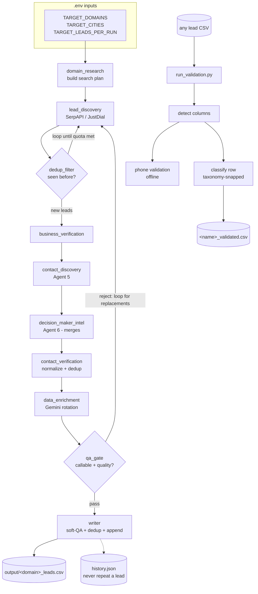

# Scrape & Validate Kit

A **fully local, clone-and-run** lead-generation engine. Give it a business *domain* and a set of *cities*; it autonomously discovers matching businesses across the public web and free APIs, mines their decision-maker contacts, AI-enriches and quality-gates each one, and writes clean, deduplicated leads to CSV — all orchestrated by a **LangGraph** state machine. A second, independent subsystem then validates and taxonomy-classifies any lead CSV (its own output, or a purchased list) entirely offline plus one cheap AI call per row.

No cloud account. No database. No deployment. Clone it, drop in a `.env`, run one command. Every external service it touches is optional and free-tier friendly — remove a key and that source simply goes dormant while the rest keeps working.

> This kit is the **discovery arm**. Its sibling, `../lead_enrichment_system/`, is the **cloud refinery** that ingests raw CSVs at scale into DynamoDB. This kit *generates* raw lead CSVs; that system *refines* them. They share one taxonomy and can share one `.env`.

---

## 1. The real-world problem this solves

You need leads for a niche — *"salons in Delhi"*, *"CA firms in Gurgaon"* — and the honest options are all bad:

- **Buying lists** is expensive, stale, and full of dead numbers.
- **Manual scraping** (Google Maps → website → LinkedIn → copy the owner's number into a sheet) is hours of soul-crushing tab-switching per 20 leads.
- **Paid enrichment SaaS** (Apollo, ZoomInfo) bills per credit and locks your data behind their platform.

What a small team actually wants: *type the niche and the city, walk away, come back to a CSV of businesses with a decision-maker name and a callable number.* That is exactly this kit. It automates the entire manual funnel — find business → verify it's real and open → find the owner → find a way to reach them → judge lead quality → write the row — and it does it on free tiers, resuming safely across runs, never generating the same business twice.

The second half solves the *next* problem: once you have a messy pile of lead CSVs (from this kit, a purchase, or an old export), which ones are actually *dentists* vs *dental-equipment resellers*? The validator tags every row with a strict, filterable **domain / sub-domain** and flags every phone number as valid/mobile/landline — turning an unfilterable pile into a segmentable database.

---

## 2. System at a glance

Two independent subsystems under one roof:

| Subsystem | Entry point | Turns… | …into |
|---|---|---|---|
| **`lead_gen/`** | `python lead_gen/main.py` | a domain + cities (from `.env`) | `output/<domain>_leads.csv` — businesses with decision-maker contacts |
| **`lead_val/`** | `python lead_val/run_validation.py` | any lead CSV in `input/` | `<name>_validated.csv` — same rows + `domain_tag`/`subdomain_tag` + phone-validation columns |



**Stack:** Python · LangGraph (agent orchestration) · google-genai (Gemini + Gemma, multi-model rotation) · httpx + BeautifulSoup (scraping) · phonenumbers (offline phone validation) · Pandas · Pydantic · python-dotenv · Playwright (optional, for browser-based sources).

---

## 3. Repository layout — every file, what it does

```
scrape_and_validate_kit/
├── README.md                       ← this file
├── .env.example                    ← copy to .env; documents every knob (§5)
├── requirements.txt                ← Python dependencies
│
├── lead_gen/                       ← SUBSYSTEM 1: discovery pipeline
│   ├── main.py                     ← entry point; loops TARGET_DOMAINS, prints summary
│   ├── config/
│   │   └── domains.json            ← domain → [subcategories]; the search vocabulary (§5.2)
│   ├── pipeline/
│   │   ├── graph.py                ← the LangGraph state machine: 10 nodes + 2 loops (§7)
│   │   └── runner.py               ← run_domain(): builds initial state, sets recursion limit
│   ├── agents/                     ← one file per pipeline stage
│   │   ├── domain_research.py      ← builds the (domain × subcategory × city) search plan
│   │   ├── lead_discovery.py       ← scrapes businesses: SerpAPI Google Maps + JustDial fallback
│   │   ├── dedup_filter.py         ← rejects already-seen businesses BEFORE any paid call
│   │   ├── business_verification.py← drops closed / uncontactable businesses
│   │   ├── contact_discovery.py    ← Agent 5: website + directory contact mining
│   │   ├── decision_maker_intel.py ← Agent 6: owner identity + reachability (registries, APIs)
│   │   ├── contact_verification.py ← normalizes/validates/dedups the 3 contact slots
│   │   ├── data_enrichment.py      ← Gemini call: size class, quality score, DM title
│   │   └── csv_writer_agent.py     ← WriterAgent: soft-QA + cross-run dedup + CSV append
│   ├── models/
│   │   └── lead.py                 ← Pydantic Lead: soft-QA warnings (region-aware phone/email)
│   ├── utils/
│   │   ├── envtools.py             ← env loading (with fallback) + shared output_dir()
│   │   ├── identity.py             ← business_id(): the ONE dedup hash, shared everywhere
│   │   ├── llm.py                  ← GeminiClient: multi-model rotation + pacing + failover
│   │   └── csv_writer.py           ← CSVWriter: the strict 18-column export schema
│   ├── output/                     ← (runtime, git-ignored) CSVs + history.json + search_state.json
│   └── logs/                       ← (runtime, git-ignored) hunter_usage.json monthly cap
│
└── lead_val/                       ← SUBSYSTEM 2: CSV validation / classification
    ├── run_validation.py           ← entry point; resume-safe row-by-row classifier
    ├── input/                      ← drop CSVs here (git-ignored)
    ├── output/                     ← <name>_validated.csv lands here (git-ignored)
    └── utils/
        ├── category_classifier.py  ← ClassifierClient: multi-model + taxonomy-snapping
        ├── column_detector.py      ← auto-detects name / phone / social columns
        ├── phone_validator.py      ← offline phonenumbers validation (region-aware)
        └── envtools.py             ← env loading (with fallback)
```

*(Runtime data — `complete_raw.csv`, `CSV DATA/`, `output/`, `logs/`, any `.env` — is git-ignored: it's private lead PII and must never reach a repo. See the repo-root `.gitignore`.)*

---

## 4. The data model — what a "lead" is as it flows

There is no database; the lead is a plain Python **dict** that accretes fields as it passes through the pipeline, then collapses into an 18-column CSV row at the end. Understanding which fields exist when explains the whole system:

| Stage | Fields the dict gains |
|---|---|
| `lead_discovery` | `raw_name`, `raw_address`, `raw_phone`, `raw_website`, `source`, `city`, `domain`, `subcategory`, `search_query` |
| `dedup_filter` | `business_id` (the permanent MD5 identity) |
| `contact_discovery` / `decision_maker_intel` | `contact_person_1..3_{name,designation,phone,email}`, `contact_confidence_score`, `contact_source`, `decision_maker_verified` |
| `contact_verification` | normalized phones/emails, `phone_missing` flag |
| `data_enrichment` | `size_class`, `lead_quality_score`, (maybe) a decision-maker title |
| `csv_writer` | (reads all of the above) → **18-column CSV row** |

**Final CSV schema** (`output/<domain>_leads.csv`):
`business name, business address, city, domain, c1 name, c1 designation, c1 number, c1 email, c2 name, c2 designation, c2 number, c2 email, c3 name, c3 designation, c3 number, c3 email, ivr risk score, data scraped date`

The `ivr risk score` (2 = a direct mobile was found, 7 = only a business/IVR line) tells a caller how likely they are to reach a human vs. a switchboard — a small but real signal for cold outreach.

---

## 5. Configuration

### 5.1 `.env` — keys and knobs

Copy `.env.example` → `.env`. **Every value is optional at the code level** — missing keys degrade gracefully (see §9). The system also has an **env fallback**: any variable not set here is read from `../lead_enrichment_system/.env`, so when both projects share a workspace you keep one credential file.

| Variable | Unlocks / controls | If unset |
|---|---|---|
| `GEMINI_API_KEY` | AI enrichment (lead_gen) + classification (lead_val) | enrichment returns neutral defaults; classification tags "Classification Failed" |
| `GEMINI_MODELS` | comma-separated model rotation roster (default `gemma-4-31b-it,gemini-3.1-flash-lite`) | uses the default pair |
| `GEMINI_RPM` | per-model pacing (default 15/min = free-tier safe) | 15 |
| `SERPAPI_KEY` | Google Maps discovery — the richest source | falls back to free JustDial HTML scraping |
| `HUNTER_API_KEY` | email finding (self-capped at 23 calls/month in code) | that step is skipped |
| `APOLLO_API_KEY` | decision-maker phone/email match | that step is skipped |
| `TARGET_DOMAINS` | which niches to hunt — **must match keys in `config/domains.json`** | pipeline has nothing to do |
| `TARGET_CITIES` | which cities (comma-separated) | search plan is empty |
| `TARGET_LEADS_PER_RUN` | quota per domain per run (default 10) | 10 |
| `TARGET_REGION_SUFFIX` | text appended to every query (e.g. `Delhi NCR`) to bias results | no suffix |
| `GEN_OUTPUT_DIR` | where CSVs + run state live (default `lead_gen/output`) | default |
| `GRAPH_RECURSION_LIMIT` | LangGraph step cap for the discovery loop (default 300) | 300 |
| `PLAYWRIGHT_ENABLED` | set `0` to force-disable browser scraping even if installed | enabled if installed |
| `PHONE_REGION` / `PHONE_COUNTRY_CODE` | phone parsing locale (`IN`/`+91`, `US`/`+1`, …) | IN / +91 |
| `VALIDATION_INPUT_DIR` / `VALIDATION_OUTPUT_DIR` | lead_val IO folders | `lead_val/input` / `output` |
| `VALIDATION_SAVE_EVERY` | rows between crash-safe checkpoints (default 25) | 25 |

### 5.2 `config/domains.json` — the search vocabulary

This is the single most important input you control. It maps each domain to the concrete phrases the scraper searches for:

```json
{ "domains": [
    { "name": "salon_spa", "subcategories": ["beauty salon", "hair salon", "spa and massage centre", "nail studio"] },
    { "name": "financial_services", "subcategories": ["chartered accountants", "loan consultants", "insurance agents"] }
] }
```

The pipeline generates one search task per **subcategory × city**. Want a new niche? Add a domain block here and list it in `TARGET_DOMAINS` — zero code changes. The `name` is what appears in the output filename and the dedup identity; the `subcategories` are what actually get typed into Google Maps.

The **taxonomy** used by the validator (`lead_val`) is a *different, richer* file, loaded from the first of: a local `llm_files/domain_taxonomy.json`, else `../lead_enrichment_system/lead_clean/configs/domains_subdomains.json` (35 domains, shared with the cloud system so both tag identically).

---

## 6. Setup

```bash
cd scrape_and_validate_kit
python -m venv .venv && .venv\Scripts\activate     # Windows  (or reuse ../lead_enrichment_system/lead_env)
pip install -r requirements.txt

# Optional: unlock browser-based discovery (Google Maps profile, LinkedIn, IndiaMART, WhatsApp)
pip install playwright && playwright install chromium
```

Then `cp .env.example .env`, fill in what you have, and run either subsystem (§7 / §8). If the sibling `lead_enrichment_system/.env` already has your Gemini key, you can leave `GEMINI_API_KEY` blank here and let the fallback supply it.

---

## 7. `lead_gen` — the discovery pipeline, node by node

This section follows one `run_domain()` from search plan to written CSV. The orchestration is a **LangGraph `StateGraph`**: ten nodes sharing one `PipelineState` dict, with two feedback loops. LangGraph is used (rather than a plain loop) because the flow genuinely branches and revisits — "not enough leads yet, go hunt more" — and a graph makes that control-flow explicit, inspectable, and safe.

### 7.0 Boot (`main.py` → `runner.py`)

`main.py` loads the env (with fallback), reads `TARGET_DOMAINS`, and calls `run_domain()` for each. `runner.py` builds the initial state (empty lead lists, `quota = TARGET_LEADS_PER_RUN`) and invokes the compiled graph with a **recursion limit of 300**. Why 300: the discovery loop revisits nodes once per search task, and LangGraph's *default limit is 25* — a real run with dozens of tasks would crash almost immediately. This single config was a silent showstopper in the original code.

### 7.1 `node_domain_research` — build the plan

Loads `config/domains.json`, crosses each subcategory with each `TARGET_CITY`, and produces a list of search tasks like `{"search_query": "\"hair salon\" Delhi Delhi NCR", "domain": "salon_spa", ...}`. The list is **shuffled**. Why shuffle: if you run the kit daily, an unshuffled plan always burns the first API calls on the same city/subcategory; shuffling spreads coverage and quota across runs. The config path is resolved from `__file__`, not the working directory — so the kit runs from anywhere.

### 7.2 `node_lead_discovery` — find businesses (one task per visit)

Pops **one** task off the plan. Why one at a time: the graph loops back here after quality-gating, so it can stop the instant the quota is filled instead of greedily scraping every task upfront and wasting API calls.

- **Primary source — SerpAPI Google Maps:** paginated, with the offset per query persisted in `output/search_state.json`. Why persist: tomorrow's run for the same query asks for results 20–40, not the same first page — so repeated runs keep finding *new* businesses instead of rediscovering the same ones.
- **Fallback — JustDial HTML scraping:** if there's no SerpAPI key or it returns nothing, the agent scrapes JustDial directly with rotating User-Agents and 2–4 s random sleeps (to look human and avoid bans). On a `401/403` from SerpAPI it logs "check your key" and falls back cleanly rather than dying.

Every raw business is stamped with `date_scraped` and the task metadata, then locally de-duplicated by `name+city` before leaving the node.

### 7.3 `node_dedup_filter` — reject known businesses *before* spending

Each business gets its permanent identity: `business_id = md5(name + city + domain)` from `utils/identity.py` — the **same function the writer uses**, so the two can never disagree on what "the same business" means (the original code re-implemented this hash in three places, a latent drift bug). The filter rejects anything already in `output/history.json` (written in a previous run) *and* runs a **cross-domain check** (was this business already captured under a different domain?). Critically, this runs **before** scraping contacts or calling any API — a duplicate costs exactly zero.

**The `dedup_router` decision:** if the quota isn't met *and* tasks remain → loop back to `node_lead_discovery` for another task. Otherwise → proceed to processing. This is the first feedback loop.

### 7.4 `node_biz_verify` — is it real and reachable?

Rejects businesses marked "permanently closed", or with *neither* a phone *nor* a website (nothing to contact). Low Google ratings are flagged, not rejected. Why lenient: at discovery time data is thin; the real filtering happens at the QA gate once contacts are known. Better to keep a maybe than discard a lead you can't yet judge.

### 7.5 `node_contact_discovery` (Agent 5) — mine reachable contacts

For each verified business it fetches the website homepage plus `/contact` and `/about`, regex-mining phone numbers and emails (lower-cased and de-duplicated), and scans the JustDial profile. With Playwright installed, it also opens the Google Maps profile. Everything here is best-effort and wrapped in try/except — a dead website never crashes the run.

### 7.6 `node_decision_maker_intel` (Agent 6) — find the *owner*, and a way to reach them

The most sophisticated stage, in two phases:

- **Phase A — Identity:** *who runs this company?* Tries ZaubaCorp company search → if it finds a CIN (corporate registration number), escalates to **MCA21**, India's government company registry, for director names straight from official filings (confidence `VERIFIED_GOVT`). Falls back to Google snippets fed to Gemini for name extraction.
- **Phase B — Reachability:** *how do I contact that person?* IndiaMART seller profiles (fuzzy-matched against Phase A names), JustDial contact persons, LinkedIn, Hunter.io email finder (self-capped 23/month via `logs/hunter_usage.json`), Apollo match, Google number mining, and — last resort — a WhatsApp Business number off the Maps page.

**The critical fix here:** Agent 6 **merges** with Agent 5's findings instead of wiping them. The original code blanked all contact fields on entry, silently throwing away everything Agent 5 discovered. Now it only *upgrades* placeholder names (like "Website Contact") to real ones, and confidence scores can only ever increase. Browser-only steps are guarded by `playwright_available` — installed → they run; not → skipped with zero errors (the original referenced `sync_playwright` without importing it, a `NameError` waiting to happen).

### 7.7 `node_contact_verify` — normalize, validate, dedup

Launders every contact: phones normalized to `+<country><10 digits>` per `PHONE_REGION` (the original hardcoded Indian mobiles and would reject any non-India dataset), emails regex-validated, the three contact slots de-duplicated, and the business's own phone promoted into slot 1 if no better contact was found. Finally it sets **`phone_missing`** — the flag the QA gate uses to decide the lead's fate.

### 7.8 `node_enrichment` — AI quality judgment

Sends a *token-minimal* payload (business name, subcategory, city, rating, DM name) to the **rotating Gemini client** (`utils/llm.py`): it round-robins the `GEMINI_MODELS`, paces each model to `GEMINI_RPM`, and on a 429 cools that model down and **fails over to the next** — so one model's quota limit never stalls the run. Returns `size_class`, a `decision_maker_title` guess, and `lead_quality_score` (1–10). If every model is down or there's no key, the lead gets a **neutral score of 5** and continues. Why neutral-not-zero: an LLM outage must never silently QA-reject an otherwise-good scraped lead.

### 7.9 `node_qa_gate` — the second loop

Rejects a lead only if `phone_missing` is true or its quality score is 0 — a lead you can't call, or the model deemed worthless. Here's the elegant part: **if a reject drops you below quota and tasks remain, the graph loops all the way back to `node_lead_discovery`** to hunt replacements. The pipeline doesn't deliver "10 minus failures"; it *fights* to deliver 10.

### 7.10 `node_writer` — commit the row

`WriterAgent` runs a **soft QA** pass via the `Lead` Pydantic model (region-aware warnings like "contact 2 phone looks invalid" — warnings only, never rejection), re-checks `history.json` one last time, appends the 18-column row to `output/<domain>_leads.csv`, and records the `business_id` in history **immediately**. From that instant the business can never be scraped again, across all future runs, forever. `main.py` then prints a per-domain summary table.

---

## 8. `lead_val` — validate & classify any CSV

Run `python lead_val/run_validation.py`. For every CSV in `input/`:

1. **Column detection** (`column_detector.py`) — auto-finds the business-name column (handles `company_name`, `business name`, …) and every phone-like column by keyword scoring. (The original missed `company_name` — the exact header your data uses.)
2. **Offline phone validation** (`phone_validator.py`) — the `phonenumbers` library (no API, no cost) stamps each number VALID/INVALID, MOBILE/FIXED_LINE, and even the carrier, per `PHONE_REGION`. Adds `<col>_valid`, `<col>_number_type`, `<col>_carrier_name`.
3. **Taxonomy-bound classification** (`category_classifier.py`) — each row's name + industry + keywords go to the rotating LLM, whose answer is **snapped to the closest entry** in the 35-domain taxonomy via fuzzy matching. The model physically cannot invent a category — "Tech Services" resolves to exactly `Technology & IT Services`. Adds `domain_tag`, `subdomain_tag`.
4. **Crash-safe + resumable** — the output saves every `VALIDATION_SAVE_EVERY` rows; re-running **reads its own partial output, skips already-tagged rows, and resumes**. Only rows tagged `Classification Failed` are retried. The original rewrote the *entire* file after *every* row (O(n²) — catastrophic on 100k rows) and re-classified everything on restart, paying twice.

Output: `output/<name>_validated.csv` — every original column, plus phone-validation columns, plus the two tags.

---

## 9. Case scenarios — what actually happens when…

**…you set `TARGET_DOMAINS=salon_spa` and `TARGET_CITIES=Delhi,Gurgaon`?** The plan is (salon subcategories × 2 cities), shuffled. The pipeline hunts task by task and stops the moment it has written `TARGET_LEADS_PER_RUN` quality leads per domain — or the plan runs dry (it writes what it found and warns).

**…you have no `SERPAPI_KEY`?** Discovery silently uses the free JustDial fallback (proven working in testing — it found a real Paharganj salon with a valid mobile). You get fewer, lower-structured leads, but the pipeline runs end to end.

**…Playwright isn't installed?** The IndiaMART / LinkedIn / WhatsApp / Google-mining steps are skipped cleanly; the httpx-based website + JustDial + Hunter + Apollo paths still run. Install Playwright later and those sources light up with zero code changes.

**…Gemini's free tier runs dry mid-run?** The model 429s, cools down, and the request fails over to the next model in `GEMINI_MODELS`. If every model is exhausted, enrichment returns the neutral default (score 5) so leads still get written — quality judgment degrades, lead capture does not.

**…there's no `GEMINI_API_KEY` at all?** Same graceful path: enrichment returns defaults, and the validator tags rows "Classification Failed" (which the next run will retry). Scraping is entirely unaffected. Paste a working key later and the *same commands* start enriching.

**…you run the exact same command twice?** The second run's discoveries hit `history.json` in `dedup_filter` and are dropped before any cost — so you accumulate *new* leads across runs instead of duplicates. `search_state.json` ensures Google Maps pagination advances rather than repeating page 1.

**…a website is dead, or a scrape throws?** Every external call is wrapped; the lead simply proceeds with whatever was found. One broken site never aborts the run.

**…your data is US, not Indian?** Set `PHONE_REGION=US` and `PHONE_COUNTRY_CODE=+1`; phone normalization and validation adapt. (Note: the *sources* — JustDial, ZaubaCorp, MCA21 — are India-centric; non-India targets would want different discovery sources, but the framework and phone handling are region-agnostic.)

**…validation crashes at row 8,000 of 100,000?** Rerun: it reads the partial output, sees 8,000 rows already tagged, and resumes at 8,001. You never pay for a classified row twice.

**…the same business appears under two different domains you're hunting?** The cross-domain dedup check in `dedup_filter` catches it — it's written once, under whichever domain reached it first.

---

## 10. The two-project relationship

```
scrape_and_validate_kit  (this, local)          lead_enrichment_system  (sibling, cloud)
  discovers + validates leads  ── CSV ──▶          ingests raw CSVs at scale into DynamoDB
  free-tier, no infra                              S3 + DynamoDB + FastAPI + Modal
```

- **Shared taxonomy:** this kit's validator falls back to the enrichment system's `domains_subdomains.json`, so a lead tagged here matches a lead tagged there.
- **Shared credentials:** `envtools.py` reads this kit's `.env` first, then the enrichment system's `.env` — one credential file for both.
- **Natural pipeline:** point the scraper's output at the cloud system's S3 `raw/` prefix and this kit becomes the ingestion feeder for the cloud refinery.

---

## 11. Design principles (the short version)

1. **Degrade, never die** — every API/key/dependency is optional; missing ones downgrade output, never crash the run.
2. **One identity, everywhere** — a single `business_id()` hash powers dedup in the filter *and* the writer, so they can never disagree.
3. **Dedup before you spend** — known businesses are dropped before any scrape or AI call.
4. **Fight for the quota** — quality rejects loop back to discovery for replacements instead of shrinking the result.
5. **Snap, don't invent** — the validator forces every classification onto a legal taxonomy value.
6. **Never pay twice** — validation resumes from its own partial output; discovery remembers every lead forever.
7. **Config over code** — niches (`domains.json`), models (`GEMINI_MODELS`), region (`PHONE_REGION`), quota — all `.env`/JSON, no code edits.
8. **Local & private by default** — no cloud, no DB; all lead PII stays on your disk (and out of git).

---

## 12. Requirements

`langgraph · google-genai · httpx · beautifulsoup4 · pandas · python-dotenv · pydantic · phonenumbers` (+ optional `playwright`). Full list in `requirements.txt`; install per §6.

---

## 13. Related project

`../lead_enrichment_system/` — the cloud-native refinery (S3 → DynamoDB → FastAPI, deployed on Modal) that ingests raw lead CSVs at scale, deduplicates against a permanent identity, AI-enriches four fields, and serves a searchable lead API. This kit generates the raw material; that system industrializes it.
